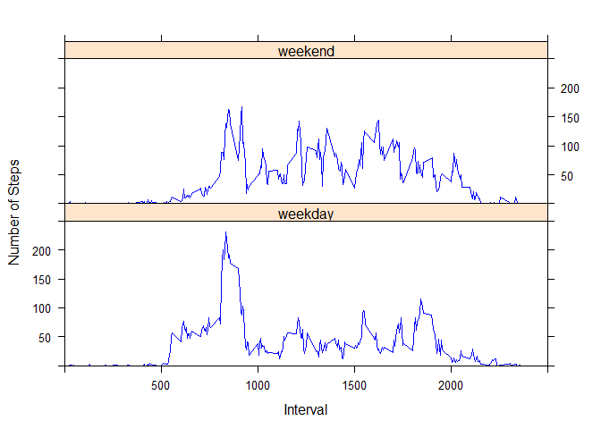

# Reproducible Research: Peer Assessment 1

# Loading and preprocessing the data

##Setting the working folder, unzipping the data file and reaching data into data frame - ActivityDF.
##Loading relevant packages for the data analysis. 
##As part of data preprocessing, the date column of the data will be converted to the Date format.


```r
 ##setwd("RepData_PeerAssessment1/")
 unzip("activity.zip")
  ActivityDF <- read.csv("activity.csv")
  if(!require(dplyr)) {
    install.packages("dplyr")
    library(dplyr)  
  }
```

```
## Loading required package: dplyr
```

```
## 
## Attaching package: 'dplyr'
```

```
## The following objects are masked from 'package:stats':
## 
##     filter, lag
```

```
## The following objects are masked from 'package:base':
## 
##     intersect, setdiff, setequal, union
```

```r
  if(!require(ggplot2)) {
    install.packages("ggplot2")
    library(ggplot2)  
  }
```

```
## Loading required package: ggplot2
```

```
## Warning: package 'ggplot2' was built under R version 3.2.3
```

```r
  if(!require(lattice)) {
    install.packages("lattice")
    library(lattice)  
  }
```

```
## Loading required package: lattice
```

```
## Warning: package 'lattice' was built under R version 3.2.3
```

```r
ActivityDF$date <- as.Date(ActivityDF$date)
```


#What is mean total number of steps taken per day?

## Duplicating ActivityDF to DF and ignoring all missing values/records

```r
DF <- ActivityDF
DF <- DF[complete.cases(DF),]
```
## To compute the Total number of steps per day, we will use the GroupBy function to Sum the steps grouped per date .  A histogram will be used to map the frequency of the 'Total Steps Per Day'.  

```r
DFTotalStepsDay <- DF %>% group_by(date) %>% summarise(StepsPerDay = sum(steps))

hist(DFTotalStepsDay$StepsPerDay, col = 'grey', main = "Histogram of Total Steps taken Per Day", xlab = "Total Steps Per Day",ylim = c(0,40))
```

\

```r
cat('The Mean of Total number of steps per day', mean(DFTotalStepsDay$StepsPerDay, na.rm = T))
```

```
## The Mean of Total number of steps per day 10766.19
```

```r
cat('The Median of Total number of steps per day', median(DFTotalStepsDay$StepsPerDay, na.rm = T))
```

```
## The Median of Total number of steps per day 10765
```
#What is the average daily activity pattern?

## Summarize the avg steps grouped by interval

```r
DFAvgStepsPerInterval <- DF%>% group_by(interval) %>% summarise(AveStepsPerInterval = mean(steps, na.rm = T))
plot(x = DFAvgStepsPerInterval$interval, y= DFAvgStepsPerInterval$AveStepsPerInterval, type = 'l', xlab = 'Intervals', ylab = 'Avg Steps Per Interval', main = "Time Series Plot - Intervals vs Average Steps Per Interval")
```

\

##2. Which 5-minute interval, on average across all the days in the dataset, contains the maximum number of steps?

```r
maxstepAvgVal <- max(DFAvgStepsPerInterval$AveStepsPerInterval, na.rm = T)
maxstepAvgInterval <- DFAvgStepsPerInterval$interval[DFAvgStepsPerInterval$AveStepsPerInterval == maxstepAvgVal]

cat("The 5-minute interval, on average, which contains the maximum number of steps is ", maxstepAvgInterval)
```

```
## The 5-minute interval, on average, which contains the maximum number of steps is  835
```

# Inputing missing values

##1. Calculate and report the total number of missing values in the dataset (i.e. the total number of rows with `NA`s)
## Using Complete.Cases to count the total missing values. 

```r
DFAll <- ActivityDF
MissVal_Total <- sum(!complete.cases(DFAll))
cat('Total Number of Missing values is ', MissVal_Total)
```

```
## Total Number of Missing values is  2304
```

```r
DFAllLen <- nrow(DFAll)
for (i in 1:DFAllLen)
{
  if(is.na(DFAll$steps[i])){
    tempInt <- DFAll$interval[i]
    DFAll$steps[i] <- DFAvgStepsPerInterval$AveStepsPerInterval[DFAvgStepsPerInterval$interval == tempInt]
  }
}

cat('The data frame with the missing values filled in is DFAll')
```

```
## The data frame with the missing values filled in is DFAll
```

```r
DFAllTtlStpsday <- DFAll %>% group_by(date) %>% summarise(StepsPerDay = sum(steps))

hist(DFAllTtlStpsday$StepsPerDay, col = 'grey', main = "Histogram of Total Steps taken Per Day - DF with no Missing data", xlab = "Total Steps Per Day",ylim = c(0,40))
```

\

```r
cat('The Mean of Total number of steps per day', mean(DFAllTtlStpsday$StepsPerDay, na.rm = T))
```

```
## The Mean of Total number of steps per day 10766.19
```

```r
cat('The Median of Total number of steps per day', median(DFAllTtlStpsday$StepsPerDay, na.rm = T))
```

```
## The Median of Total number of steps per day 10766.19
```

# Are there differences in activity patterns between weekdays and weekends?


```r
weekends <- c('Saturday','Sunday')
DFAllLen <- nrow(DFAll)
for (i in 1:DFAllLen){
  
  if(weekdays(DFAll$date[i]) %in% weekends){
    DFAll$DayIndicator[i] = 'weekend'
  }else{
    DFAll$DayIndicator[i] = 'weekday'
  }
}


DFAllAvgStepsPerInterval <- DFAll%>% group_by(interval,DayIndicator) %>% summarise(AveStepsPerInterval = mean(steps, na.rm = T))

with(DFAllAvgStepsPerInterval,xyplot(AveStepsPerInterval~interval|DayIndicator, type = 'l',show.given = T, 
layout = c(1,2),  xlab = "Interval", ylab = "Number of Steps", ylim = c(0,250), xlim = c(0,2500), col = 'Blue'))
```

\
